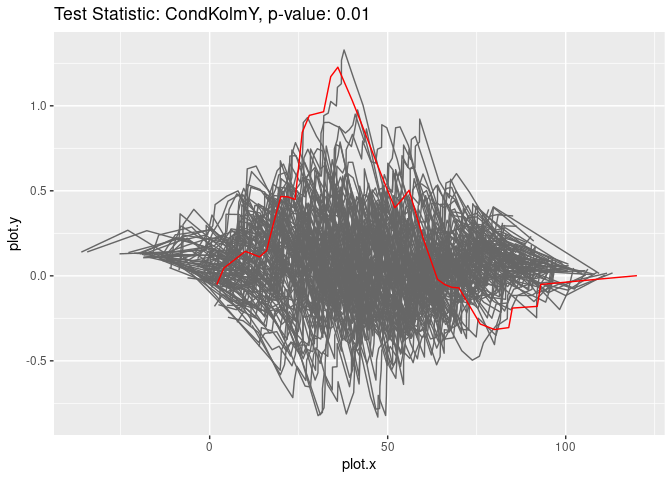

<!-- README.md is generated from README.Rmd. Please edit that file -->

# gofreg

This R package provides classes and methods to fit parametric regression
models to given data and to perform bootstrap-based goodness-of-fit
tests using different test statistics.

The data can either consist of $(X,Y)$ pairs of covariates and response
variables or in case of random censorship it consists of tuples
$(X, Z, \delta)$ denoting covariates, censored survival times and
censoring indicators. The package includes different parametric
regression models (mostly generalized linear models) and test statistics
(based on different papers). It can easily be extended by other
user-defined models and test statistics.

## Installation

You can install it from CRAN

``` r
install.packages("gofreg")
```

or github

``` r
devtools::install_github("gkremling/gofreg")
```

## Example

This is a basic example which shows how to fit a parametric regression
model to a given dataset and afterwards perform a goodness-of-fit test.
In this example, we use the dataset `datasets::cars`, a generalized
linear model with normal distribution and the conditional Kolmogorov
test statistic of the marginal distribution of $Y$ defined in Kremling &
Dikta (2024) [arXiv:](https://arxiv.org/abs/).

``` r
library(gofreg)

data <- dplyr::tibble(x = datasets::cars$speed, y = datasets::cars$dist)
model <- GLM.new(distr = "normal", linkinv = identity)
model$fit(data, params_init = list(beta = 3, sd = 2), inplace = TRUE)
print(model$get_params())
#> $beta
#> [1] 2.908838
#> 
#> $sd
#> [1] 16.09429
gt <- GOFTest$new(data = data, model_fitted = model, test_stat = CondKolmY$new(), nboot = 100)
print(gt$get_pvalue())
#> [1] 0.01
gt$plot_procs()
```


